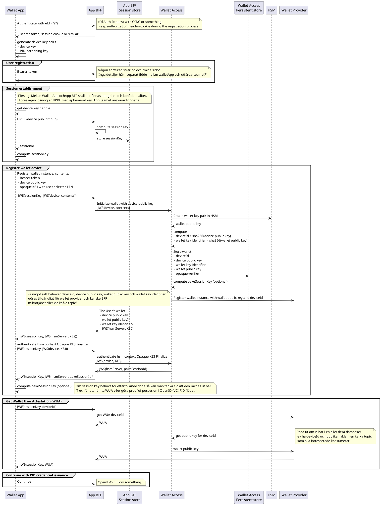

# Wallet Registrering

# Frågor att diskutera med andra team

## Metadata
Vi har metadata som deviceId, wallet public key och wallet key identifier som vi behöver lagra och göra tillgänglig för t.ex. wallet provider.
Vi har även metadata som opaque verifier som är hemligare och som bara hsm server i wallet access behöver.

Förslagsvis: Accessmekanismen äger det metadatat och har det i sin databas. Vidare publiceras allt som ska delas med andra team/tjänster på en kafka topic som alla intresserade konsumerar from beginning. Utöver det finns det en mikrotjänst som servar datat via REST GET.
