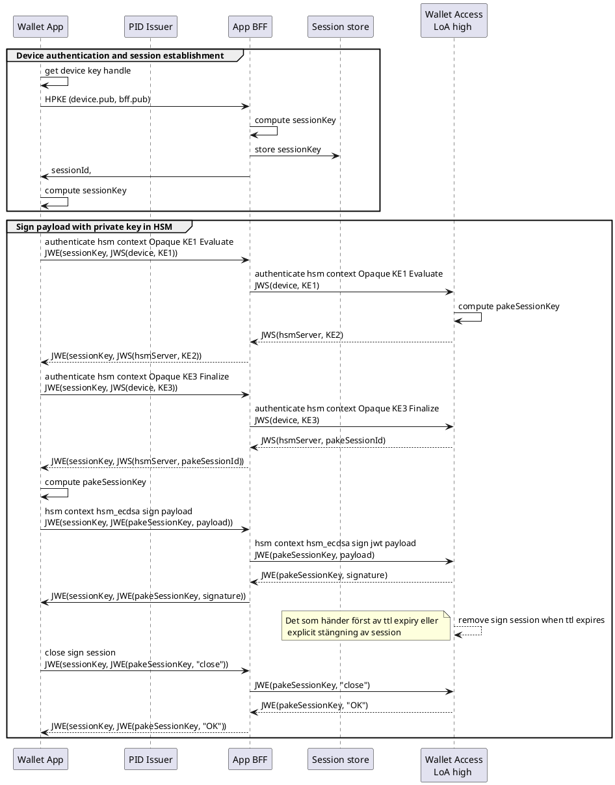

# Signera

Signera något med användarens HSM nyckel på serverns från wallet app.

```plantuml
@startuml

participant "Wallet App" as walletApp
participant "PID Issuer" as pidIssuer
participant "App BFF" as walletBff
participant "Session store" as sessionStore
participant "Wallet Access\nLoA high " as walletAccess

group Device authentication and session establishment
walletApp -> walletApp: get device key handle
walletApp -> walletBff: HPKE (device.pub, bff.pub)
walletBff -> walletBff: compute sessionKey
walletBff -> sessionStore: store sessionKey
walletBff -> walletApp: sessionId, 
walletApp -> walletApp: compute sessionKey
end
group Sign payload with private key in HSM
walletApp -> walletBff: authenticate hsm context Opaque KE1 Evaluate\nJWE(sessionKey, JWS(device, KE1))
walletBff -> walletAccess: authenticate hsm context Opaque KE1 Evaluate\nJWS(device, KE1)
walletAccess -> walletAccess: compute pakeSessionKey
walletAccess --> walletBff: JWS(hsmServer, KE2)
walletBff --> walletApp: JWE(sessionKey, JWS(hsmServer, KE2))

walletApp -> walletBff: authenticate hsm context Opaque KE3 Finalize\nJWE(sessionKey, JWS(device, KE3))
walletBff -> walletAccess: authenticate hsm context Opaque KE3 Finalize\nJWS(device, KE3)
walletAccess --> walletBff: JWS(hsmServer, pakeSessionId)
walletBff --> walletApp: JWE(sessionKey, JWS(hsmServer, pakeSessionId))
walletApp -> walletApp: compute pakeSessionKey

walletApp -> walletBff: hsm context hsm_ecdsa sign payload\nJWE(sessionKey, JWE(pakeSessionKey, payload))
walletBff -> walletAccess: hsm context hsm_ecdsa sign jwt payload\nJWE(pakeSessionKey, payload)
walletAccess --> walletBff: JWE(pakeSessionKey, signature)
walletBff->walletApp: JWE(sessionKey, JWE(pakeSessionKey, signature))

walletAccess --> walletAccess: remove sign session when ttl expires
note left: Det som händer först av ttl expiry eller \n explicit stängning av session
walletApp -> walletBff: close sign session\nJWE(sessionKey, JWE(pakeSessionKey, "close"))
walletBff -> walletAccess: JWE(pakeSessionKey, "close")
walletAccess --> walletBff: JWE(pakeSessionKey, "OK")
walletBff --> walletApp: JWE(sessionKey, JWE(pakeSessionKey, "OK"))
end
@enduml
```

